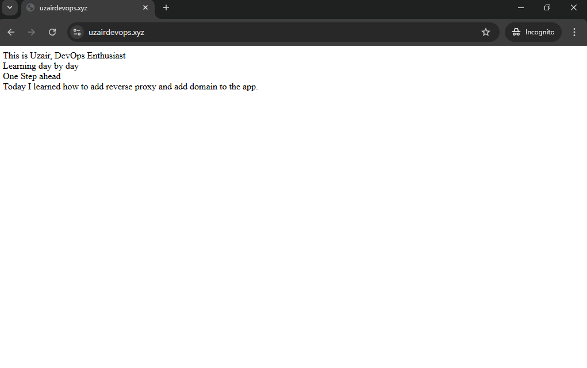

# 🚀 Production-Ready CI/CD Pipeline with Docker, Nginx, Domain & HTTPS on AWS EC2
---
## Overview
This project demosntrates a complete end-to-end DevOps workflow where a containerized application is automatically built, pushed and deployed to a live production server.
It goes beyond basic deployment by implementing 
- Reverse Proxy architecture 
- Custom domain mapping 
- Secure HTTPS communication
---
## Architecture 
graph TD 
User[User / Browser] -->|HTTPS 443|
Nginx -->|HTTP 5000| App[Docker Container App]
subgraph AWS EC2
    Nginx 
    App
end 
subgraph CI/CD pipeline 
	GitHub[GitHub Repo] --> Actions[GitHub Actions]
	Actions -->DockerHub[Docker Hub]
	DockerHub -->|Pull Image| App
end
Nginx -->|SSL Termination| Secure[HTTPS Enabled]
Users -->|HTTP 80| Redirect[HTTP -> HTTPS Redirect]
Redirect --> Nginx
---
## Tech Stack
- AWS EC2 
- Docker 
- Github Actions (CI/CD)
- Docker Hub
- Nginx (Reverse Proxy)
- Domain + DNS (Namecheap)
- SSL Certificate (Let's Encrypt)
---
## CI/CD Workflow
1. Code is pushed to Github
2. Github Actions Pipeline is triggered 
3. Docker image is built 
4. Image is pushed to Docker Hub
5. EC2 instance pulls latest image 
6. Existing container is stopped and removed
7. New container is deployed

---
## Deployment Features 
- Automated deployments on every push
- Zero manual intervention
- Custom domain integration
- HTTPS enabled using Let's Encrypt
- HTTP -> HTTPS redirection
- Reverse proxy using Nginx 
---
## Nginx Reverse Proxy
Nginx acts as a gateway between users and the application:
- Routes incoming traffic to the container 
- Hides internal application ports
- Handles SSL termination
- Enforces secure HTTPS connections 
---
## HTTPS Configuration
- SSL certificates issued via Let's Encrypt 
- Automaic certificate renewal enabled
- Secure communication between client and server
- Eliminates "Not secure" browser warnings
---
## Challenges and Debugging 
- SSH authentication issues in CI/CD 
- Managing '.pem' keys and permissions (WSL environment)
- Debugging YAML syntax errors in Github Actions 
- Docker port conflicts during redeployment
- Nginx configuration and reverse proxy setup
- SSL configuration and HTTP -> HTTPS redirection
---
## Screenshots
CI/CD Pipeline running 

Running Docker Containers 

Live Application (HTTPS)

Docker Hub Image

---
## Live Application
```browser
https://uzairdevops.xyz
```
---
## Key Learnings 
- Building real-world CI/CD Pipelines
- Automating deployment using Github Actions
- Managing production servers on AWS EC2
- Implementing reverse proxy architecture 
- Securing applications with HTTPS 
- Debugging real DevOps issues 
---
## Future Improvements
- Migrate deployment to kubernetes (Amazon EKS)
- Implement load Balancing
- Add monitoring & logging (prometheus, Grafana)
- Introduce blue-green/ rolling deployments 

---
## 💛 Connect 
If you are working on similar projects or learning DevOps, feel free to connect or share feedback.
--- 
## Author
**Uzair Munir** DevOps Learner | Cloud & Automation Enthusiast</br> Github:</br> https://github.com/uzairchini555-gif Karachi, Pakistan.

