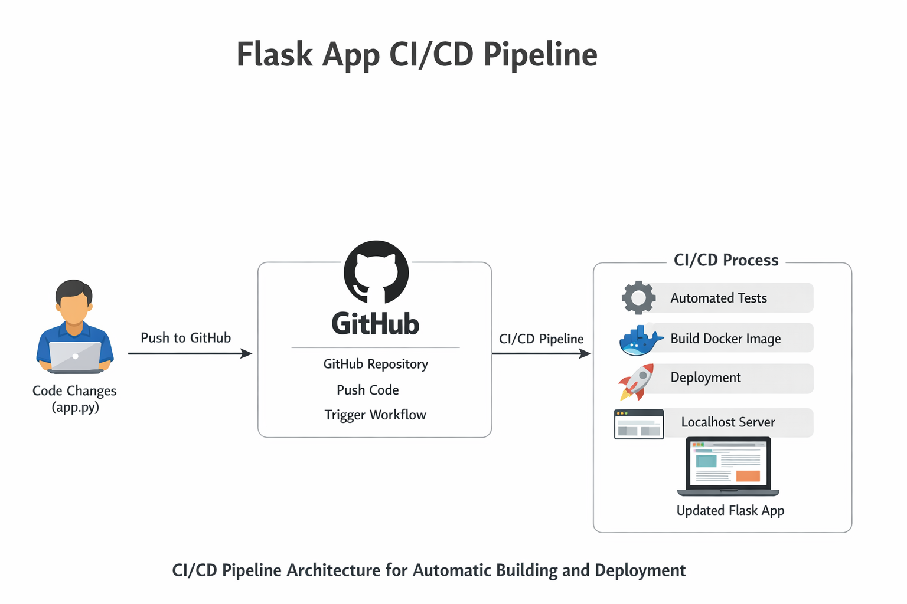

# Project-App
A simple Flask app web application, Dockerized with CI/CD workflow to demonstrate DevOps fundementals. This project showcases containerization, version control, and automated build pipelines, making it siutable for DevOps internshipportfolios.
---
## **Project Overview**
Project-App is a Python Flask application that serves basic content in the browser. The project demonstrates:
- Docker containerization 
- Continuous integration /Continuous Deployment (CI/CD) using Github Actions 
- Local development and debugging 
- Git version control
---
## **Features**
- Runs a Flask web app inside a Docker container 
- CI/CD pipeline triggers on Github pushes 
- Automated Docker image build for every update 
- Easy local deployment
---
## **Architecture Diagram**

---
## **Description**
1. Developer edits code in **local repo**.
2. Code is pushed to **Github**
3. **Github actions workflow** triggers automatically.
- Check out Code 
- Installs dependencies 
- Build Docker image 
4. Docker container runs Flask app.
5. Application is accessible in browser (localhost or server)
---
## **Installation/ Running Locally**
1. Clone the repository
```bash 
git clone <your_repo_url>
cd project
```
2. Build Docker Image 
```bash 
docker build -t project-app .
```
3. Run container 
```bash
docker run -d -p 5000:5000 project-app 
```
4. Open Browser and visit
http://localhost:5000
   OR 
```bash 
curl http://localhost:5000
```
5. Optional for live development, mount code as volume:
```bash 
docker run -d -p 5000:5000 -v $(pwd)/app:/app project-app
---
## **CI/CD Workflow**
- Located in .github/workflows/main.yml
- Triggered on push or pull request to main branch 
- Workflow steps: 
 a. Checkout Code 
 b. Set up python
 c. install depencies 
 d. Build Docker image
 e. Optional Run container for verifiction 
---
## **Technologies Used**
- Python 3.11
- Flask
- Docker 
- Git/Github
- Github Actions (CI/CD)
---
## **Future Enhancement**
- Deploy to Kubernetes cluster (EKS or Minikube)
- Add health check and automated tests 
- Push Docker image to Docker hub 
- Integrate auto-deploytment to remote server 

## Author 
Uzair Munir - DevOps Enthusiast

