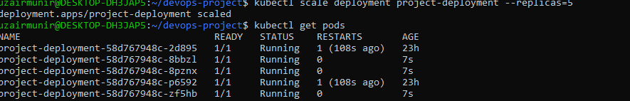
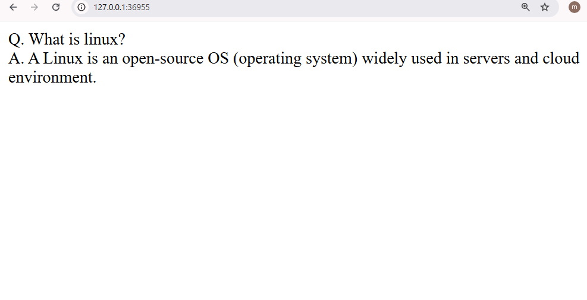
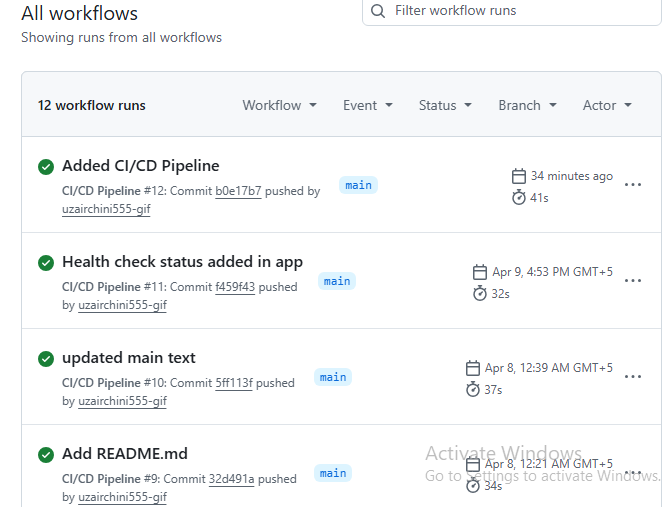
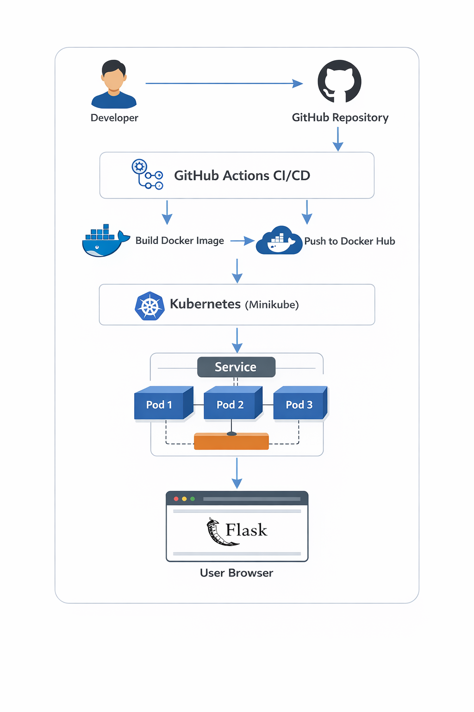

# DevOps Project: Docker + Kubernetes + CI/CD
This project is a simple Flask-based application that I gradually improved into a more production-like setup using DevOps practises.
The idea was not just to run an app, but to understand how it moves from code to to a scalable and managed environment.
---
## 🚀What I Built
- A Python Flask application
- Containerized the app using Docker 
- Deployed it on kubernetes using Minikube 
- Exposed it using a NodePort service 
- Implemented scaling (multiple replicas)
- Tested self-healing by deleting pods 
- Added a "/health" endpoint for basic health checks 
- Set up a CI/CD pipeline using Github Actions to automatically build and push Docker image 
---
## Tech Stack
- Python (Flask)
- Docker 
- Kubernetes (Minikube)
- Github Actions (CI/CD)
- Docker Hub
---
## How It Works 
1. Code is pushed to Github 
2. Github Actions Pipeline triggers automatically 
3. Docker image is built and pushed to Docker hub 
4. Kubernetes Deplyment runs the application using container image
5. Service exposed the app to the browser 
6. Kubernetes ensuers: 
	- Pods restarts automatically if they fail (self-healing)
	- Application can scale using replicas 
---
## Key Features 
### 🔹 Scaling 
Application can run multiple replicas: 
```bash 
kubectl scale deployment project-deployment --replicas=5
```
🔹 Scaling 
If a Pod is deleted, kuberenets recreates it automatically (self-healing)
```bash 
kubectl delete pod <pod_name>
```
🔹 Health Check 
Basic /health cendpoint to verify application status 
---
## ▶ How To Run 
```bash 
#Start Minikube
minikube start
# Use Minikube Docker 
eval $(minikube docker-env)
# Build Image 
docker build image -t project-app .
# Apply Kubernetes Config 
kubectl apply -f deployment.yaml
kubectl apply -f service.yaml
# Access App
minikube service project-service
```
📷 Screenshots 
- Scaling and Running Pods

- Browser output 

- CI/CD Pipeline running 

- Architecture Diagram

---
## What I Learned
- Differnece between Docker and Kubernetes roles 
- How Kubernetes manages containers.
- Importance of health check in production systems
- How scaling and self-healing works in practise 
- Basics of CI/CD pipeline using Github Actions 
---
## Future Improvements
- Deploy to Cloud Kuberenets (AWS EKS)
- Add monitoring (prometheus & Grafana)
- Implement full CD (auto-deploy to cluster)
---
## 🙌 Final Note 
This project helped me understand how applications are build, deployed and managed in a real DevOps workflow. Still learning and improving.
---
## Author 
**Uzair Munir**
DevOps Learner | Cloud & Automation Enthusiast
Github:
https://github.com/uzairchini555-gif
Karachi, Pakistan.
