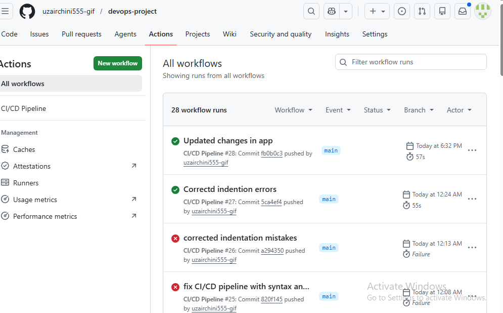
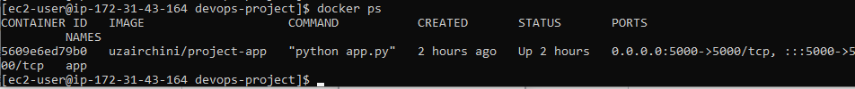
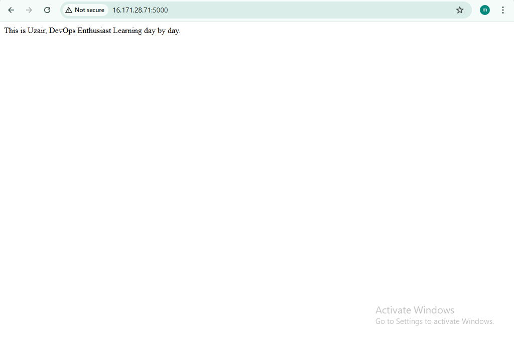
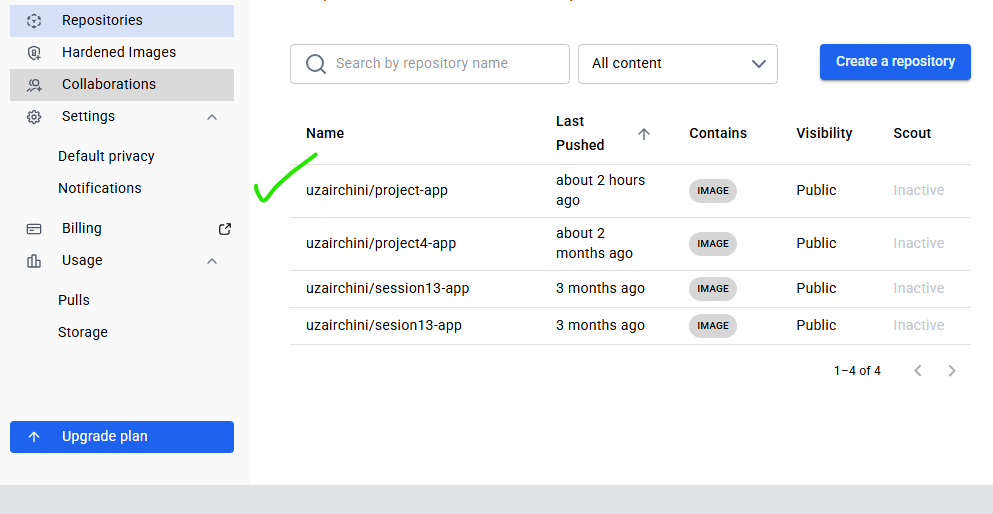

# 🚀 CI/CD Deployment of a Dockerized App on AWS EC2
This project demonstrates a complete end-to-end DevOps workflow where a containerized application is automatically built, pushed and deployed to a live server.
## What this project does
- Builds a  Docker image from application code 
- Pushes the image to Docker Hub
- Automatically deploys the latest version to an AWS EC2 instance 
- Runs the application in a container exposed on port 5000

All of this happens automatically on every push to the main branch.
---
## Tech Stack
- AWS EC2
- Docker 
- Github Actions (CI/CD)
- Docker Hub
---
## Workflow
1. Code is pushed to Github
2. Github Actions pipeline is triggered 
3. Docker image is built
4. Image is pushed to Docker Hub
5. Old conatiner is stopped and removed 
7. New container is deployed 
--- 
## Deployment Strategy
This Deployment ensures:
- Old container don't block new ones 
- Port conflicts are handled 
- Application is always running with the latest version
--- 
## Challenges I faced
- SSH authentication issues between Github Actions and EC2
- Managing '.pem' keys and permissions in WSL 
- Debugging YAML syntax errors in CI/CD pipeline
- Handling Docker port conflicts during redeployment 
---
## Output
The applications is live and accessible via:
```bash
https://EC2_Public_IP:5000
```
---
## What I learned 
- Setting up real CI/CD pipelines
- Debugging production-like deployment issues
- Managing infrastructure and containers together 
- Importance of automation in DevOps 
---
## ScreenShots 
- CI/CD pipeline success

- Running containers on EC2

- Live Application

- Docker Hub Image

---
## Future Improvements
- Add Nginx reverse proxy
- Configure custom domain + HTTPS
- Migrate deployment to kubernetes (EKS)
---
## 💛 Connect 
If you are working on similar projects or learning DevOps, feel free to connect or share feedback.
--- 
## Author
**Uzair Munir** DevOps Learner | Cloud & Automation Enthusiast</br> Github:</br> https://github.com/uzairchini555-gif Karachi, Pakistan.
