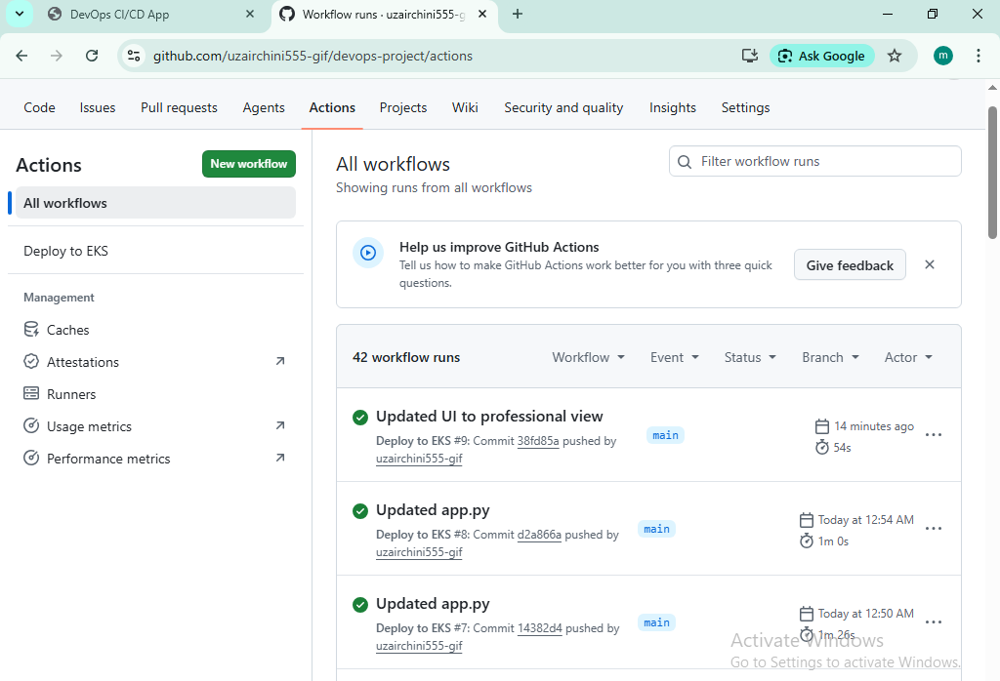
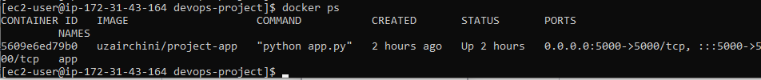
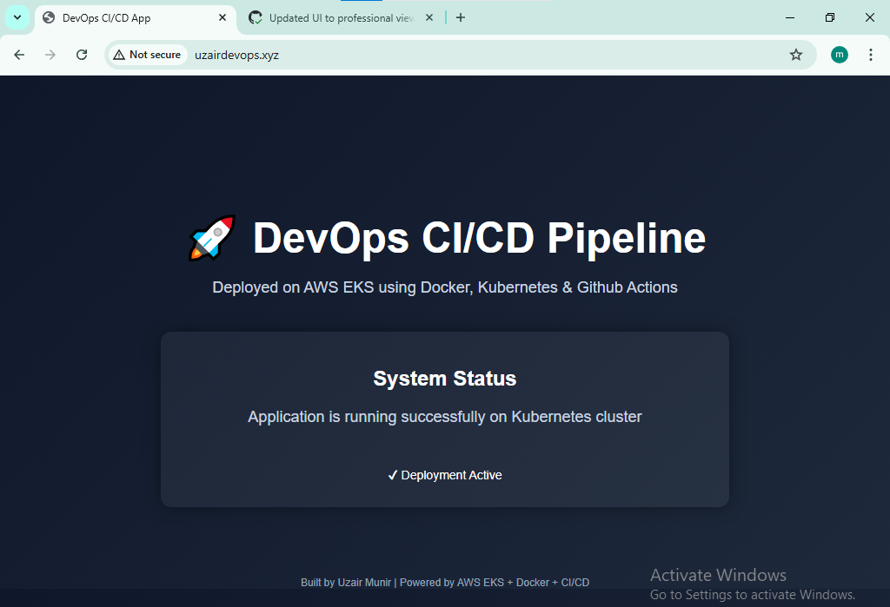
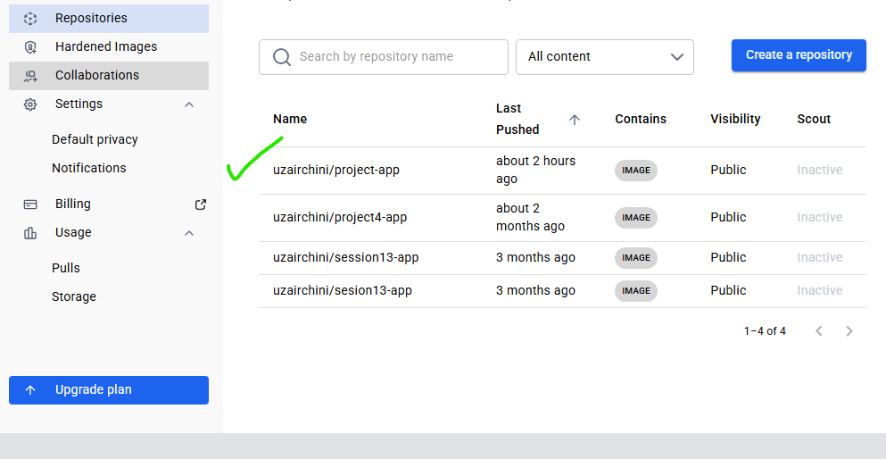

# 🚀 End-To-End CI/CD Deployment on AWS EKS with kubernetes
This project demonstrates a complete DevOps workflow where a Dockerized application is automatically built, pushed and deployed to a Kubernetes cluster on AWS EKS.
It goes beyond basic deployment by integrating CI/CD automation and improving the application UI to a more professional, production-ready look.
---
## 🌟 Project Highlights
- Fully automated CI/CD pipeline using Github Actions 
- Dockerized application deployed on AWS EKS 
- Kubernetes Deployment and service configuration 
- Public access via AWS LoadBalancer 
- Custom Domain integration
- Upgraded UI with a clean and Professional design
---
## UI Improvement 
The application UI was enhanced from a basic layout to a more polished, modern and user-friendly interface 
This reflects real-world production thinking - not just functionally, but also presentation and user experience 
---
## Tech Stack
- **Cloud**: AWS EKS 
- **Containerization**: Docker 
- **Orchestration**: Kubernetes 
- **CI/CD**: Github Actions 
- **Registry**: Docker Hub
- **Networking**: AWS LoadBalancer 
- **Domain**: Custom DNS configuration 
---
## CI/CD Workflow 
Every push to the 'main' branch triggers: 
1. Source code checkout 
2. Docker image build 
3. Push image to Docker Hub
4. Update kubeconfig for EKS 
5. Deploy latest version to kubernetes

```text
Github -> Actions -> Docker -> EKS -> Live -> Application
```
---
## Kubernetes Architecture 
- Deployment 
 - Manages application pods 
 - Ensures high availability 
- Service (LoadBalancer)
 - Exposes the application to the internet 
 - Automatically provisions AWS ELB 
---
## Deployment Flow 
Code Push -> CI/CD Pipeline -> Docker build -> Docker Hub -> Kubernetes Deployment -> Live App
--- 
## Live Application 
```Accessible via:
http://uzairdevops.xyz
```
---
## Challenges & Learnings
While building this project I faced and solved real-world DevOps issues:
- EKS node group creation failure 
- pod scheduling errors due to resource limits
- CrashLoopBackOff debugging 
- YAML configuration mistakes 
- Docker image and tag mismatched 
- CI/CD pipeline debugging 
These challenges helped me understand how production systems behaves and how to troubleshoot them effectively.
---
## Screenshots 
CI/CD Pipeline running 

Docker Containers Running

Live Application (Updated UI)

Docker Hub Image

---
## Future Improvements 
- Add HTTPS using AWS certificate manager
- Implement Kubernetes ingress for advanced routing 
- Add monitoring (Prometheus + Grafana)
- Enable Auto-scaling (HPA)

---
## Author 
**Uzair Munir**
DevOps Intern | Cloud & Automation Enthusiast, Karachi, Pakistan
Github: https://github.com/uzairchini555-gif
Linkedin: https://linkedin.com/uzair-munir

